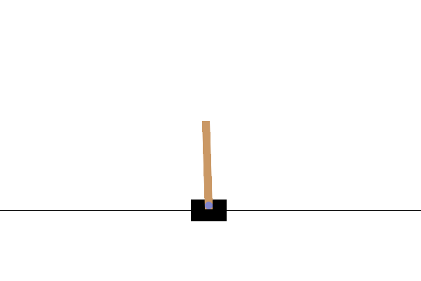
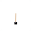

# Dreamer-CartPole  

This project involved receiving the CartPole-v1 environment as an image and implementing Dreamer components minimally to conduct reinforcement learning.  

# Requirements  
pip install -r requirements.txt  

# How to Run  
Simply run it from dreamer_cartpole.ipynb. If you have a trained model, please adjust the file path accordingly.  

# Render  

